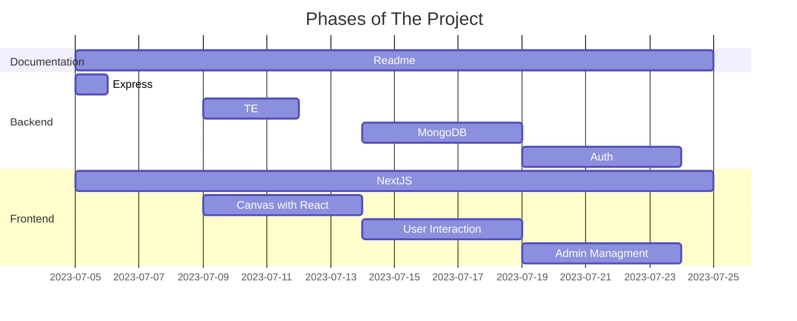
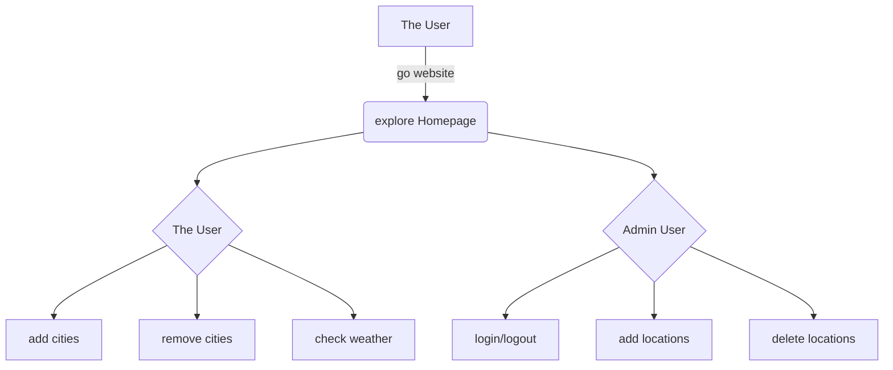

# Capstone Project

## Introduction
This project is intended to present at IOD/AUT computer software engineering course. It utilizes contemporary web application development technologies to demonstrate knowledge learnt from the course. The main of this project should be responsive, eye appealing and full featured to the end users/stakeholders. 

The weather is volatile down the south in New Zealand, which makes it harder to predict because of the terrain, altitude and near coast cloud fronts. 

In Otago region and across all New Zealand, numerous outdoor workers are battling with harsh weather conditions, espacially in winter season. The ability of easily getting access to weather information is a daily routine for stakeholders including service providers. However, many free online resources are not free or not intuitive to use, so we are obsessed with creating a weather forecast service for New Zealand users by using the best online resources.

## Objectives
- Express NodeJS backend to provide data CRUD operations.
- Next.js frontend with ReactJS / typescript to cater a full featured UI.
- Authentication for admin users to manage backend data.

## Technologies / Tools
- MongoDB
- NextJS / React / Typescript
- TailwindCSS
- GitHub

Tutorial:

## Prerequisites

You must have Node.js and npm installed on your machine. This project
was built against the following versions:

- Node v18.16.0
- npm v9.5.1

## Getting started

- Clone this repository to your computer.
- `cd` into the each backend and frontend project folder and run `npm install`.
- chnage the port number in  `.env` file under backend folder .
- In the backend folder, run `npm start` to start the API server.
- Change to frontend folder, run `npm run dev` to start the development server for nextjs.
- Visit http://localhost:3000 in your browser to see the application in action.

## How to use

- Click the button on the top right to toggle the navigation menu.  
- Click the **My cities** menu link to open the my cities page. 
- Type in the city name in the search input field and find the city you are looking for. By clicking the add button, the city will be displayed in the below accordion.
- The accordion is clickable as well, simply click each title to open the city's settings. You may click the **Set Home** button or **Remove** button to manage your cities.
- Now go back to **Home** page or click on the **Weather 7 Days** menu item, it will redirect you to the main slides.
- You may use your finger to swipe between each slide on your mobile devices or just click the arrow buttons on middle left and right, or click the small white boxes on the bottom to navigate to other slides, such as 7 days forecast for your home city or the corresponding data charts. 
- Use the **Clear Cache** menu item, if your map doesn't seem right, which could happen once your screen changes size. However, this occassion can be detected automatically and it corrects itself later on.
- For administrator, if you desire to alter the backend database, you have to use username and password to login, by clicking on the login menu item under **Admin** menu link.
- After being verfified your identity, admin user can manage locations in the **Locations** page. Be cautious of altering any backend database data, once its done, the locations data is changed or lost forever and for everyone who are using this App. 

## Project Phases

## Frontend Workflow

## Frontend State Management
- By managing App states, we have better controls over how the application behaves.
- Hence, we better the user experience by promting timely corresponding messages. 
- For example, the current state could be **Connecting**, **Fetching**, **Preprocessing**, **Done**, **Processing** or none of those.
- Busy indicators are used interally to toggle on/off UI elements, such as the navigation arrow buttons on the map, and the small white boxes on the bottom.

## Conceptual Ideas
- Normally we don't care about user's data, especially in this case as we are the public information providers / presenters, but instead we focus on the user's interactions and experiences. Therefore we could cut down some meaningless expensives procedures. For example, why do people have to create an account for the public information services? They most probably don't even want to because of privacy reasons, and we don't have to collect their personal information.   
- Interally, in our App, we also practically minimised network traffic and data persistence. They are expensive and can be slow. Meanwhile, we maximised data and components sharing with React/Next JS, which runs in memory. They are cheap and fast. In addtion, some crucial user data is saved in local storage. 
- Overall, we better the user experience by making our App just like a desktop program as much as possible.  

## Design Patterns
- The philosophy above is embodied in our design patterns as well. We share key elements, typically data and functions that can be commonly used by React in frontend and shared by components / page routers. For instance, weather collection of cities, App states, busy indicators, user data, authentication token, and such.
- For the sake of precluding performance issue, html canvas is seperated from React in a way that they don't interfer each other. This is to avoid breakdown when heavy computation is undergoing. However, we use promises to communicate between the two layers, namly the graphics and web elements. 
- React JS has a limit when it comes to data sharing. Those limits are often embodied as timely references, but they are not noticable if heavy computation is avoided or uninterfered.