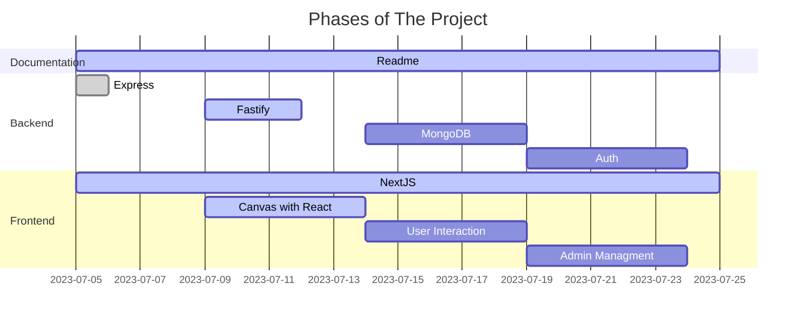
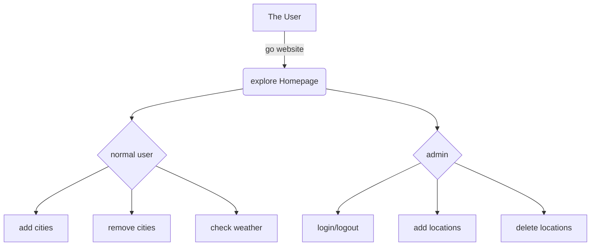

# Capstone Project

## Introduction
This project is intended to present at IOD/AUT computer software engineering course. It utilizes contemporary web application development technologies to demonstrate knowledge learnt from the course. The main of this project should be responsive, eye appealing and full featured to the end users/stakeholders. 

In Otago region and across all New Zealand, a lot of outdoor workers are battling with harsh weather conditions, espacially in winter season. The ability of easily getting access to weather information is a daily routine for every forecast provider. However, many free online resources are not free or not intuitive to use, so we are obsessed with creating a weather forecast service for New Zealand users by using the best online resources.

## Objectives
- Express / Fastify backend to provide data CRUD operations.
- Next.js frontend with ReactJS / typescript to cater a full featured UI.
- Authentication for admin users to manage backend data.

## Technologies / Tools
- Fastify / MongoDB
- NextJS / React / Typescript
- TailwindCSS
- GitHub

